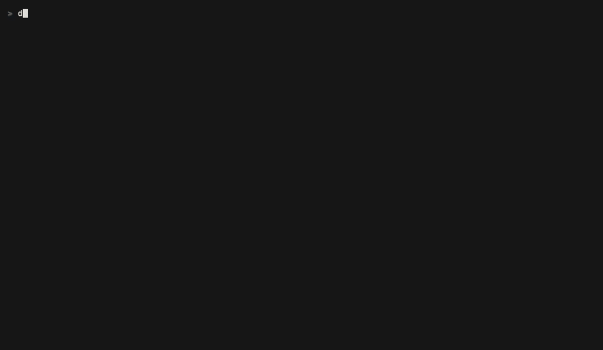

# Den

A terminal watcher for the git repositories in a folder. Tiles per repo show
dirty state at a glance — staged, modified, untracked, conflicts, ahead /
behind, stash count, latest tag, and CI status — without leaving the
terminal. Background `git fetch` keeps ahead/behind counts live.



▶ [den in 60 seconds](https://youtu.be/D_HsJrh-_l8)

## Install

Homebrew (macOS, Linux):

```sh
brew tap bearocratic/tap
brew install den
# upgrade later with: brew upgrade den
```

Cargo (any platform with a Rust toolchain):

```sh
cargo install --git https://github.com/bearocratic/den    # latest main
cargo install --git https://github.com/bearocratic/den --tag v0.8.1   # pinned
```

The binary lands in `~/.cargo/bin/den`.

## Usage

```sh
den                              # scan the current directory
den ~/bearocratic                # scan a specific folder
den ~/work ~/personal            # scan multiple folders
den --depth 6 ~/bearocratic      # change recursion depth (default 4)
den --fetch-interval 60 .        # fetch every 60s (0 disables)
den --no-ci .                    # skip `gh` calls
den ls                           # list saved sessions
den forget <id>                  # delete a saved session
den help                         # full help, or `den help <command>`
```

Press `:` to open the command palette. Every shortcut, with a description,
in one place.

## Persistence

State lives under `~/.den/`:

- `~/.den/hidden.txt` — global hidden list (a vendor mirror you mute
  stays muted everywhere).
- `~/.den/sessions/<id>/` — one folder per unique combination of base
  directories you opened with. Holds `pins.txt`, `bases.txt`, and
  `settings.toml` (sort mode, show-hidden, last filter). Run `den ls` to
  list, `den open <id>` to relaunch, `den forget <id>` to delete one.

Existing `~/.config/den/{pins,hidden}.txt` from earlier versions is
migrated into the new layout on first launch.

## Keys

| Key | Action |
|-----|--------|
| `↑↓←→` / `hjkl` | Move selection |
| `↵` | Toggle detail pane |
| `1` / `2` | Focus status / diff |
| `/` | Filter tiles by name |
| `:` | Open command palette |
| `p` / `x` | Pin / hide focused repo |
| `e` / `o` / `s` / `g` / `A` | Open in editor / lazygit / shell / GitHub / GitHub Actions |
| `r` / `F` / `P` | Refresh all / fetch focused / pull focused |
| `y` / `Y` | Copy repo path / GitHub URL |
| `i` / `S` / `L` | README / stash / open-PRs overlay |
| `O` | Cycle sort: default → ci red first → dirty first → by recency |
| `b` | Cycle base filter (when watching multiple bases) |
| `q` | Quit |

## Optional integrations

- `lazygit` — `o` drops into lazygit on the focused repo. Den suspends,
  lazygit takes over, Den resumes when you quit.
- `$SHELL` — `s` drops into a shell at the repo path with the same
  suspend/resume.
- `$EDITOR` / `$VISUAL` — `e` opens the selected repo there (falls back to
  `code`).
- System browser — `g` opens the repo's GitHub page if `origin` is set;
  `A` opens the GitHub Actions tab.
- `gh` CLI — required for CI status badges. If `gh auth login` hasn't been
  run, badges stay blank and Den prints a hint at startup. Disable with
  `--no-ci`.

## Platforms

- macOS (Apple Silicon, Intel)
- Linux (amd64, arm64)

## Releases

Tagged builds and changelogs live under
[Releases](https://github.com/bearocratic/den/releases). Each release ships
prebuilt binaries; the Homebrew formula at
[`bearocratic/homebrew-tap`](https://github.com/bearocratic/homebrew-tap)
tracks the latest tag.

## License

Open source under the [Apache License 2.0](LICENSE). The name "Den"
and the Bearocratic bear remain Bearocratic OÜ's — see `NOTICE`.
Contributions are welcome; see [CONTRIBUTING.md](CONTRIBUTING.md).
